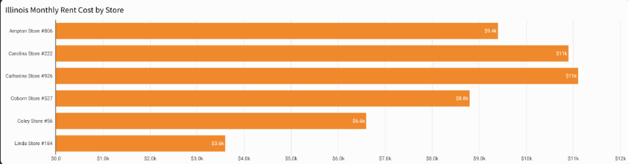
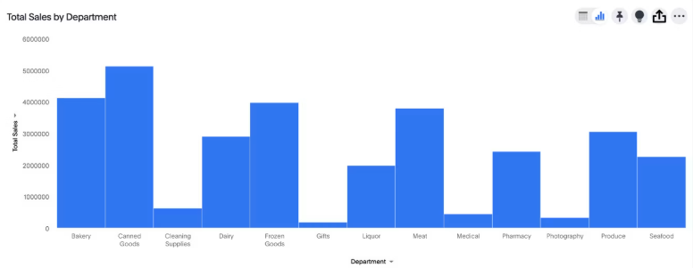
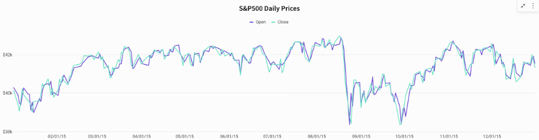
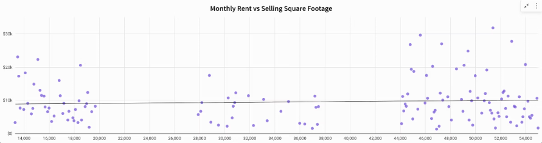
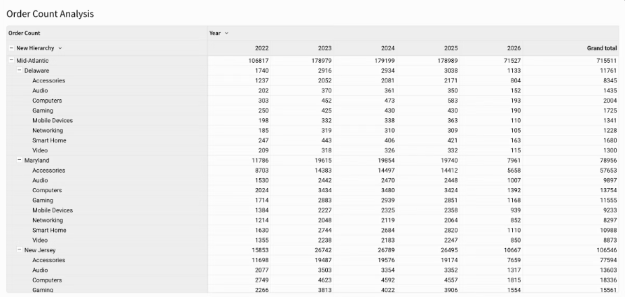
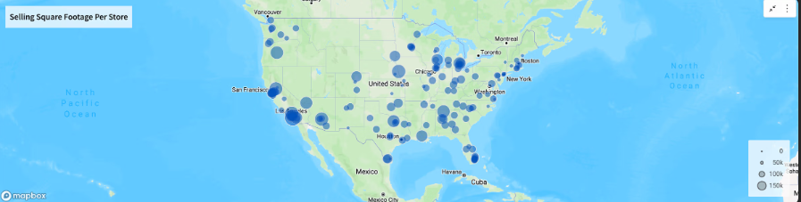
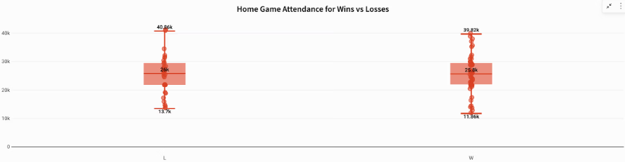
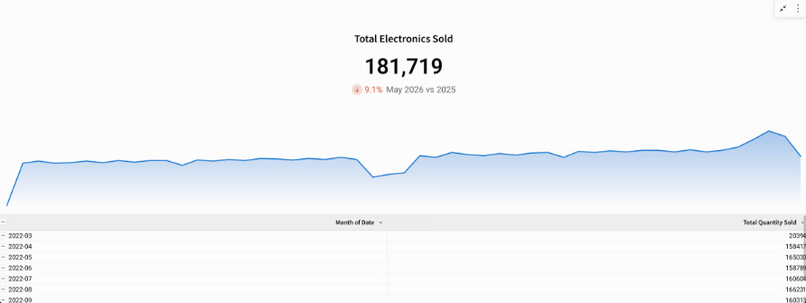
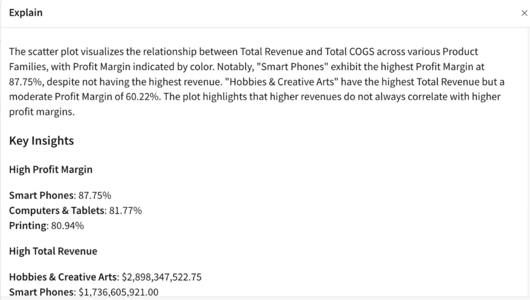

O que é visualização de dados?
---------------------------

A visualização de dados é a prática de codificar dados na forma de diagramas, gráficos, tabelas e mapas, de modo que padrões, tendências e valores atípicos fiquem visíveis à primeira vista, em vez de ficarem ocultos em linhas. Por exemplo, uma equipe de marketing que acompanha o desempenho de uma campanha em 12 canais ao longo de seis meses poderia ficar olhando para uma planilha de 72 células para identificar qual canal está apresentando baixo desempenho, ou dar uma olhada rápida em um mapa de calor, onde o canal mais fraco se destaca em um único tom de vermelho.

Uma visualização útil responde a uma questão analítica específica e orienta você a tomar uma [decisão baseada em dados](https://www.sigmacomputing.com/blog/guide-to-data-driven-decision-making).

A visualização de dados tem como objetivo encurtar o caminho entre um número na tela e uma decisão que você possa colocar em prática. Mas a maioria das ferramentas de inteligência de negócios (BI) se limita a informar o que aconteceu, sem explicar o porquê.

Por exemplo, uma ferramenta de BI informará que a receita caiu 14% no mês passado, mas deixará que o analista transfira os dados para uma planilha, entre em contato com alguns colegas e passe dois dias reconstruindo uma história que o gráfico deveria ter contado em segundos. O “porquê” está em outro lugar, assim como a decisão.

A [visualização de dados](https://www.sigmacomputing.com/blog/data-visualization-presenting), quando bem feita, revela o “porquê” junto com o “o quê” e permite que as pessoas na linha de frente explorem os dados por conta própria.

Os 4 principais benefícios da visualização de dados
-----------------------------------------

Visualizações de dados eficazes promovem a compreensão, o insight e a ação. Veja por quê:

### 1\. Padrões e relações tornam-se visíveis em grande escala

A visualização torna padrões e relações visíveis em grande escala ao codificar os dados espacialmente, de modo que seus olhos possam processar milhares de valores em paralelo, em vez de lê-los sequencialmente, linha por linha.

Os gráficos reduzem horas de leitura a segundos de reconhecimento. Uma planilha com 10.000 linhas de dados de vendas regionais contém todas as respostas que um executivo de alto escalão poderia desejar. O desafio é que essas 10.000 linhas também levam horas para serem lidas. Codifique os mesmos dados em um gráfico de linhas, e uma queda de três quartos na receita fica visível em segundos.

Uma tabela obriga você a manter os valores anteriores na memória de trabalho enquanto analisa os novos, um por um; um gráfico permite que a posição, o comprimento e a cor façam esse trabalho de comparação por você, revelando tendências, agrupamentos e valores atípicos em um único olhar.

### 2\. A informação se torna acessível em toda a empresa

Um gráfico bem elaborado torna a informação acessível a qualquer pessoa, independentemente de seus conhecimentos em estatística. Quando os dados são apresentados visualmente, as equipes de finanças, operações, vendas e sucesso do cliente podem analisar a mesma visualização e chegar à mesma conclusão sem a necessidade de um analista para fazer a interpretação.

Funcionários da linha de frente, como gerentes regionais, representantes de contas e líderes de operações, geralmente são os primeiros a precisar agir com base nos dados. Seu gerente regional não precisa de uma consulta SQL. Ele precisa ver que seu território está apresentando um desempenho abaixo do planejado e saber o que fazer a respeito. A visualização é a camada que transforma um repositório cheio de fatos em algo que todas as equipes podem utilizar.

### 3\. A narrativa de dados impulsiona as decisões

Visuais sequenciados podem contar uma história mais convincente do que um único ponto de dados. Um gráfico mostrando a rotatividade por coorte, seguido por outro mostrando a rotatividade por caminho de integração e, em seguida, outro mostrando o aumento na retenção decorrente de um novo fluxo de integração, conta uma história que uma única tabela jamais poderia contar.

[A narrativa de dados](https://www.sigmacomputing.com/blog/data-storytelling-infographic) é o que torna sua análise persuasiva em uma reunião. O mesmo conjunto de dados que confunde um executivo em uma tabela dinâmica pode garantir o orçamento quando você o apresenta como uma sequência de visualizações que percorrem o problema, a causa e a ação recomendada.

### 4\. A exploração e a descoberta revelam o que os relatórios deixam de mostrar

Relatórios estáticos respondem às perguntas que você já sabia fazer. [Visualizações interativas](https://www.sigmacomputing.com/blog/interactive-data-visuals) permitem que você faça perguntas complementares na hora: filtrar por uma região, agrupar por linha de produto, isolar os últimos 30 dias, comparar com o trimestre anterior. Cada interação revela algo que o relatório original não foi projetado para mostrar.

As descobertas mais valiosas raramente vêm do primeiro gráfico que você cria. Elas vêm do quinto, depois que você já explorou os dados, descartou três hipóteses e se deparou com uma relação que ninguém esperava.

Quais são os tipos de visualização de dados?
-----------------------------------------

Cada tipo de gráfico é criado para uma questão analítica específica; a regra geral é identificar primeiro a relação quantitativa e, em seguida, escolher a forma de representação que a ilustre com clareza.

### Tabelas: a base para comparar valores exatos entre linhas

[Tabelas](https://www.sigmacomputing.com/blog/introducing-table-styles-with-sigma) organizam os dados em linhas e colunas, exibindo cada valor exatamente como foi registrado. Elas são a escolha certa quando você precisa consultar valores precisos ou comparar números em várias dimensões ao mesmo tempo. Quando o objetivo é o reconhecimento de padrões, em vez da consulta de valores, um gráfico é mais adequado.

### Gráficos de barras: classificação e comparação de categorias discretas

[Gráficos de barras](https://www.sigmacomputing.com/blog/best-visualization-histogram-bar-chart) comparam valores entre categorias nominais e discretas: receita por região, número de funcionários por departamento, linhas de produtos classificadas por taxa de devolução. Use barras horizontais quando os rótulos das categorias forem longos. Os gráficos de barras ficam mais claros quando a linha de base começa em zero. Se o objetivo for enfatizar diferenças menores, outro tipo de gráfico pode ser mais adequado à questão.

Os gráficos de barras comparam valores entre categorias e funcionam melhor com uma linha de base zero para comparações claras e precisas.

[Histogramas](https://www.sigmacomputing.com/blog/best-visualization-histogram-bar-chart) agrupam dados numéricos em intervalos contíguos e exibem a frequência dos valores em cada um deles. Os histogramas lidam com intervalos numéricos contínuos, sem espaços entre as barras. Os gráficos de barras lidam com categorias discretas, com espaços entre elas.

### Gráficos de linha: acompanhando como uma métrica se altera ao longo do tempo

Os gráficos de linha são a forma padrão de representar dados de séries temporais. Eles funcionam melhor quando os pontos seguem uma sequência significativa, como o tempo. Com categorias não ordenadas, a inclinação da linha de conexão pode sugerir relações que não são reais.

Gráficos de linha mostram tendências ao longo do tempo, em que a sequência dos pontos de dados é importante e a linha de conexão reflete mudanças significativas.

### Gráficos de dispersão: mostrando a relação entre duas variáveis

Gráficos de dispersão revelam se a correlação é forte ou fraca, positiva ou negativa, linear ou não linear. Eles são eficazes para identificar valores atípicos. Além disso, como são menos familiares para a maioria do público, os gráficos de dispersão destinados a executivos precisam de um contexto interpretativo.

Os gráficos de dispersão visualizam como duas variáveis se comportam em conjunto, tornando imediatamente visíveis aglomerados, tendências, lacunas e valores atípicos em um campo de pontos de dados.

### Tabelas dinâmicas: resumindo grandes conjuntos de dados por várias dimensões ao mesmo tempo

[Tabelas dinâmicas](https://www.sigmacomputing.com/blog/pivot-table-secrets) segmentam os dados por produto, região, trimestre e prioridade em uma única visualização. Elas se destacam quando a dimensionalidade é mais importante do que o reconhecimento visual de padrões.

No Sigma, as tabelas dinâmicas permitem que os usuários segmentem e comparem dados em tempo real por dimensões como produto, região e trimestre em uma única visualização interativa.

### Mapas de calor: revelando densidade e concentração em uma grade

[Mapas de calor](https://www.sigmacomputing.com/blog/heatmaps) usam a intensidade da cor para codificar a magnitude em uma matriz bidimensional. Eles respondem à pergunta sobre quais combinações de duas variáveis categóricas apresentam os valores mais altos ou mais baixos. Use escalas de cores sequenciais ou divergentes. Paletas de cores do arco-íris distorcem a percepção.

Os mapas de calor utilizam a intensidade das cores para destacar valores altos e baixos em uma matriz, tornando visíveis instantaneamente os padrões e as combinações que se destacam entre as categorias.

### Mapas em árvore: visualizando relações entre partes e o todo em escala

Os mapas em árvore dividem um retângulo em blocos aninhados, cujos tamanhos são proporcionais aos valores que representam. Eles são adequados para dados hierárquicos: alocação orçamentária por função, depois por centro de custo e, por fim, por item de linha. Para dados planos e não hierárquicos, um gráfico de barras ordenadas é mais claro.

### Gráficos de caixa e bigodes: mostrando distribuição, dispersão e valores atípicos

Um gráfico de caixa resume uma distribuição com quartis, mediana e amplitude, com valores atípicos representados individualmente. Gráficos que levam em conta a distribuição tornam os valores anormais visíveis de uma forma que uma média nunca consegue. Usar um gráfico de barras com médias quando os dados são assimétricos induz ativamente ao erro.

Os gráficos de caixa visualizam a dispersão dos dados por meio de quartis, medianas e valores atípicos, facilitando a identificação de variações e valores incomuns além das simples médias.

### Cartões de KPI: destacar um único número que responda a uma única pergunta

[Cartões de KPI](https://www.sigmacomputing.com/blog/when-in-doubt-kpi-bar-chart-table) exibem um valor em destaque, geralmente acompanhado de um indicador de comparação: em relação à meta, em relação ao período anterior ou à direção da tendência. Um número sem um ponto de referência não pode ser interpretado como um indicador de desempenho.

Os cartões de KPI apresentam uma métrica-chave juntamente com o contexto, como tendências, metas ou desempenho anterior, ajudando os usuários a entender rapidamente se o número indica progresso ou motivo de preocupação.

Como a IA autônoma está redefinindo o que uma visualização pode fazer
-------------------------------------------------------

Hoje, a maioria dos gráficos é estática: eles mostram o que aconteceu, mas param por aí. Não conseguem explicar por que um número mudou, indicar a próxima pergunta a ser feita ou ajudar você a tomar alguma atitude a respeito. A IA muda isso ao tornar o próprio gráfico interativo. Em vez de exportar os dados ou entrar em contato com um analista, você pode fazer perguntas diretamente no gráfico, obter explicações geradas pela IA, gerar visualizações complementares e até mesmo acionar ações, tudo isso sem sair da página.

### 1\. A IA explica o que o gráfico mostra

A IA transforma um gráfico estático em uma conversa que você pode ter com seus dados. Pense nisso como um chatbot vinculado à visualização à sua frente: clique na queda em um gráfico de linha ou na célula vermelha em um mapa de calor, pergunte “por quê?” em linguagem simples, e a IA analisa os dados subjacentes e fornece uma explicação em segundos, bem ao lado do gráfico.

É aí que a IA e a visualização de dados se fundem. Em vez de uma saída unidirecional que mostra o “o quê” e deixa o “por quê” a cargo de um analista, o gráfico se torna uma interface bidirecional onde cada resposta aponta para a próxima pergunta que vale a pena fazer, sem perder o contexto visual que revelou o padrão em primeiro lugar.

A IA transforma gráficos em conversas interativas, permitindo que os usuários cliquem em padrões, façam perguntas complementares em linguagem simples e compreendam instantaneamente o “porquê” por trás da visualização, sem sair do contexto dos dados.

### 2\. A IA ajuda você a criar a próxima visualização

Depois de entender o “porquê”, geralmente você deseja uma análise diferente dos dados para confirmá-lo. A IA ajuda você a chegar lá sem precisar reconstruir a pasta de trabalho. Ela sugere perguntas complementares com base no que o gráfico revelou, gera novas colunas a partir de um comando em linguagem simples, escreve a fórmula que você, de outra forma, teria que procurar na documentação e monta o próximo gráfico a partir do mesmo conjunto de dados regulamentado. O analista, que costumava ser o gargalo para a próxima visualização, não está mais no caminho crítico.

### 3\. A IA toma medidas com base no que o gráfico revelou

A IA agentiva fecha esse ciclo agindo com base no que a visualização revelou: gravando um registro no data warehouse, encaminhando uma aprovação, sinalizando uma exceção para revisão ou iniciando um fluxo de trabalho posterior.

A questão arquitetônica é onde a IA é executada. A IA que fica fora do seu data warehouse perde a linhagem, prejudica a auditoria e cria uma segunda camada de governança para a TI gerenciar. A IA que é executada dentro do seu data warehouse herda os controles que você já possui, de modo que cada ação que ela realiza é rastreável em relação aos mesmos dados e políticas que seus gráficos já respeitam.

De gráficos e painéis a aplicativos de IA
--------------------- ----------------

Um aplicativo de dados impulsionado por IA (“aplicativo de IA”) é a resposta arquitetônica para tudo o que foi abordado até agora: uma única tela onde você visualiza dados do data warehouse em tempo real, os explora de forma interativa, obtém análises geradas por IA no contexto e registra suas decisões de volta no data warehouse sem precisar trocar de ferramenta.

Enquanto um painel exibe um gráfico e para por aí, um aplicativo de IA vai além, permitindo que você aprove uma previsão, substitua um orçamento, sinalize uma exceção ou encaminhe um registro para revisão e registre essa ação diretamente no data warehouse.

Principais conclusões
-------------

*   A visualização de dados reduz o tempo entre os dados e a decisão, revelando padrões, tendências e valores atípicos que ficariam ocultos nas linhas de uma planilha.
*   A IA está levando a análise de dados para a visualização por meio de consultas em linguagem natural, detecção de anomalias e análise contextual, o que permite chegar ao “porquê” sem sair do gráfico.
*   Quando consultas em tempo real, gráficos interativos, análise de IA e gravação de alterações estão reunidos em uma única tela, você visualiza os dados, os explora, decide e registra a decisão em um único lugar, transformando insights em ação sem sair do fluxo de trabalho.

