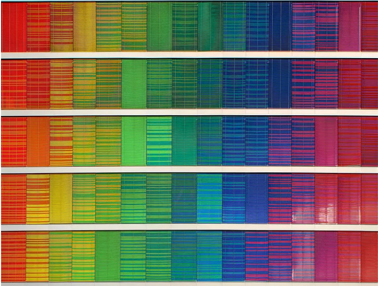
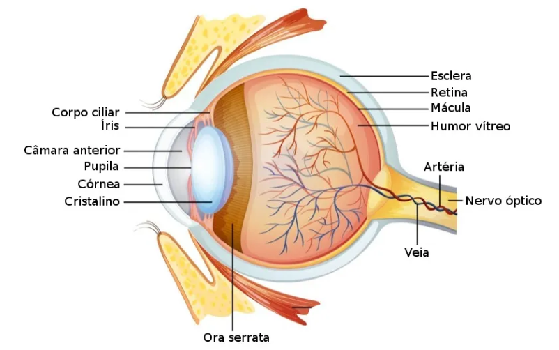
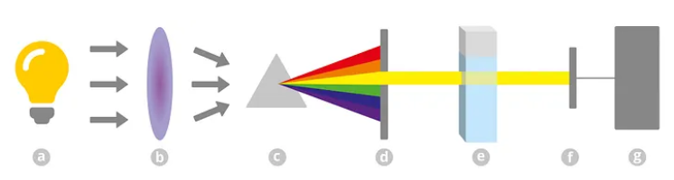
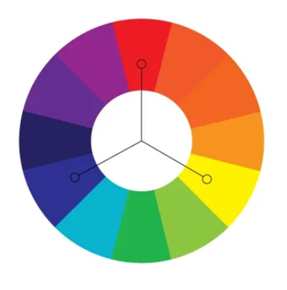
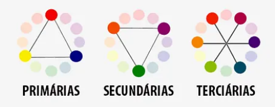
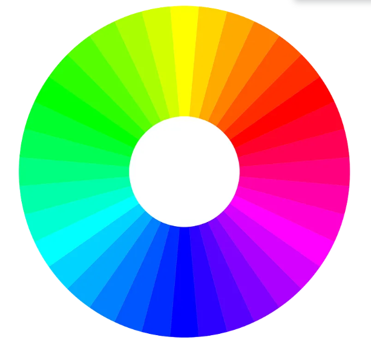

Visão humana e teoria das cores
---------------------------

*“Para compreender o mundo que está ao seu redor, o ser humano é equipado com um sistema visual que lhe permite captar e perceber os objetos através da luminosidade, em um complexo processo cognitivo.”*

### Uma breve introdução ao seu sistema visual

O **sistema visual** é composto pelos olhos e pelos nervos, e as estruturas acessórias: pálpebras, supercílios, músculos e aparelho lacrimal.

A visão funciona através do processamento de dados recebidos pelo encéfalo, por intermédio dos receptores sensoriais ativados pela luz.

**Retina**: Contém dois tipos de células que detectam a luz e a transformam em impulsos nervosos. É a área do olho que recebe a luz, transforma em sinais nervosos e transmite para o cérebro através dos nervos óticos.

Os dados projetados na tela atingem a retina, onde células fotorreceptoras iniciam o processamento visual:

**Cones S, M e L**: São os três tipos de receptores de cor (sensíveis ao Azul, Verde e Vermelho). O cérebro processa imagens com alto contraste entre esses receptores em menos de 100 milissegundos, antes mesmo de uma decisão consciente do leitor.

    • A Importância do Cinza: Como os bastonetes (percepção de formas/brilho no
     escuro) e cones trabalham juntos, o cinza é considerado uma das cores mais vitais
     no design de dados. Ele serve para construir o contexto (linhas de grade, dados
     secundários), permitindo que cores saturadas se destaquem apenas nos pontos
     críticos de atenção.

    • Acessibilidade (Daltonismo): Cerca de 8% dos homens e 1% das mulheres têm 
      limitações nos cones da retina (especialmente na distinção entre verde e
      vermelho). Testar paletas em simuladores de daltonismo garante que a informação
      não seja perdida

**Colorimetria**

É a ciência e a prática de determinar e especificar cores quanto a matiz, saturação e intensidade.

A **colorimetria** tem aplicação em todas as áreas que tem relação com as cores, tais como fotografia, publicidade, arte digital, entre outras. Estuda e quantifica como o sistema visual humano percebe a cor e cita métodos de análise espectrofotométricos de absorção da luz.

    A espectrofotometria baseia-se na medida quantitativa da absorção da luz pelas 
    soluções, onde a concentração na solução da substância absorvente é proporcional à
    quantidade de luz absorvida.

### Cores

As diferentes cores, ou espectros luminosos, que podem percebidos pelo sistema humano correspondem a pequena faixa de frequências espectro eletromagnético, inclui as ondas de microondas, os infravermelhos, os ultravioleta, os raios X e os raios gama.

*“O que vemos como cores em uma luz são, na verdade, diferenças de comprimento de onda.”*

Muitas cores podem ser geradas por um único comprimento de onda, como as luzes vermelha e verde puras. Outras cores só podem ser produzidas por luzes com vários comprimentos de onda, como roxo ou rosa.

**Primárias, secundárias e terciárias**

Um sistema de cores é um modelo que explica as propriedades ou
o comportamento das cores num contexto particular.

*“As cores podem ser produzidas a partir de uma combinação das
primárias, ou então, da composição de suas combinações.”*

As tres cores **- vermelho (magenta), amarelo e azul (ciano) -** são chamadas de primárias, porque nada pode ser misturado para produzi-los: eles devem ser feitos ou comprados.

Misturando pares de cores primárias chegaremos aos laranjas, verdes e violetas, que são chamados de cores secundárias.

Já as terciárias são misturas obtidas de uma cor primaria mais uma cor secundaria.

### RGB e CMYK

**CMYK e RGB** são padrões de cor utilizados em design de projetos, na criação de materiais gráficos, webdesign, material destinado a publicidade impressa, e uma infinidade de outras situações.

**CMYK** corresponde às iniciais das cores Cian (ciano), Magenta (magenta), Yellow (amarelo) and Black (preto).

Este é um padrão de quatro cores primárias, que combinadas formam cores ilimitadas. O padrão CMYK é mais usado em impressoras domésticas e na técnica de offset.

**RGB** corresponde às iniciais das 3 cores Red (vermelho), Green (verde) e Blue (azul). Este padão é utilizado para exibição em monitores de computador e televisores em geral é também o padrão das impressoras Fine Art.